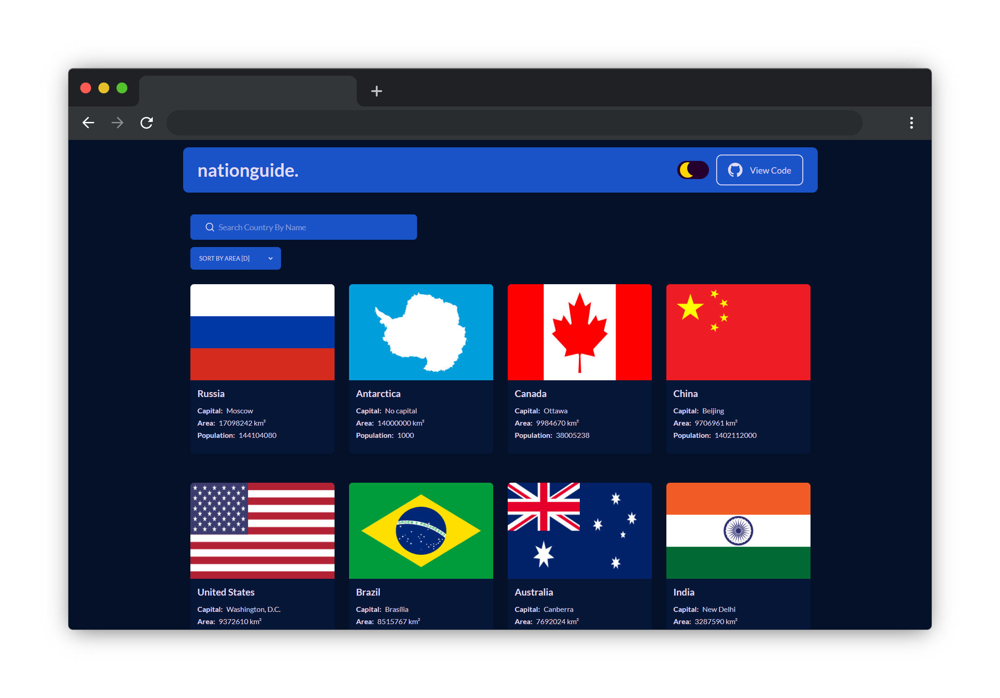
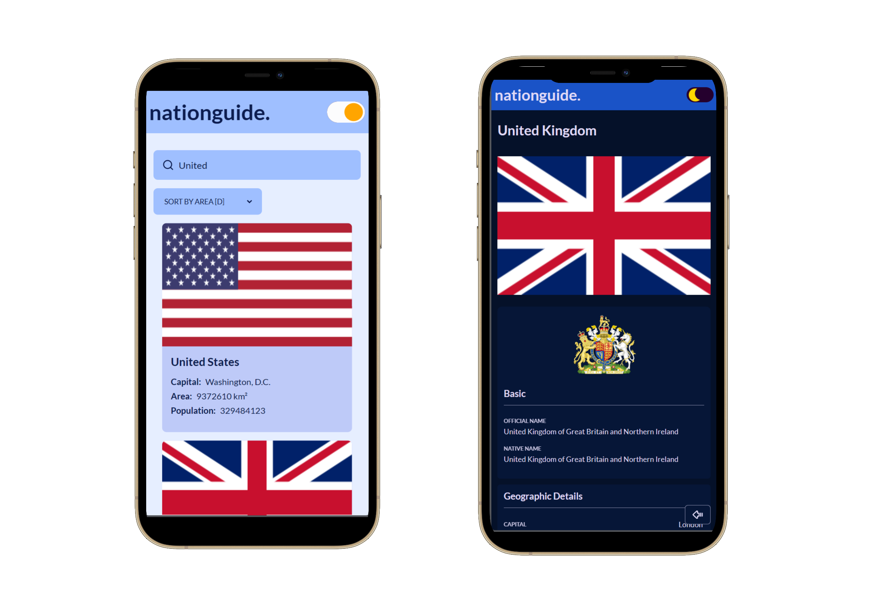

<a name="readme-top"></a>

<details> 
  <summary>Table of Contents</summary>

- [🌍 Nation Guide - Country Information Webapp](#-nation-guide---country-information-webapp)
  - [🚀 Visit Website](#-visit-website)
  - [🛠 Built With](#-built-with)
    - [🧰 Tech Stack](#-tech-stack)
    - [🔥 Key Features](#-key-features)
  - [💻 Getting Started](#-getting-started)
    - [Prerequisites](#prerequisites)
    - [Setup](#setup)
    - [Install](#install)
    - [Usage](#usage)
    - [Run tests](#run-tests)
    - [Deployment](#deployment)
  - [📧 Contact](#-contact)
  - [🔭 Future Features](#-future-features)
  - [🤝 Contributing](#-contributing)
  - [💖 Show your support](#-show-your-support)
  - [🙏 Acknowledgments](#-acknowledgments)
  - [💎 Useful Resources](#-useful-resources)
  - [📝 License](#-license)

</details>

# 🌍 Nation Guide - Country Information Webapp

[](https://github.com/indiecodermm/nation-guide)
[](https://github.com/indiecodermm/nation-guide/blob/main/LICENSE)
[](https://github.com/indiecodermm/nation-guide/commits)


**Nation Guide** is an interactive web application designed to provide users with comprehensive information about countries from around the world. Users can browse through a list of all countries, search for specific countries, and view detailed information about each country. The app is built using React and Redux, and is fully responsive for mobile devices.





<p align="right">(<a href="#readme-top">back to top</a>)</p>


## 🚀 Visit Website

Experience the live version of this website at [Nation Guide Webapp](https://nation-guide-icmm.onrender.com).

<p align="right">(<a href="#readme-top">back to top</a>)</p>


## 🛠 Built With

### 🧰 Tech Stack

- 
- 
- 
- 
- 
- 
- 

<p align="right">(<a href="#readme-top">back to top</a>)</p>


### 🔥 Key Features

- Browse comprehensive list of all countries
- Quickly search for countries by name
- Countries are sortable by area or name
- View detailed information on each country
- Up-to-date data powered by REST Countries API
- Design optimized for mobile devices

<p align="right">(<a href="#readme-top">back to top</a>)</p>


## 💻 Getting Started

To get a local copy up and running, follow these steps.

### Prerequisites

In order to run this project you need [Node.js](https://nodejs.org/en/) installed on your machine.

### Setup

Clone this repository to your desired folder:

```sh
  cd my-project
  git clone git@github.com:IndieCoderMM/nation-guide.git .
```

### Install

Install the dependencies with:

```sh
  npm install
```

### Usage

To run the project, execute the following command:

```sh
  npm start
```

### Run tests

To run tests, run the following command:

```sh
  npm run test
```

### Deployment

You can deploy this project using:

```sh
  npm run build
```
This will create a production-ready build of your website in `build/` folder, which you can use to deploy on a static site hosting platform.

<p align="right">(<a href="#readme-top">back to top</a>)</p>


## 📧 Contact 

I am always looking for ways to improve my project. If you have any suggestions or ideas, I would love to hear from you.

[](https://github.com/IndieCoderMM)
[](https://linkedin.com/in/hthantoo)
[](mailto:hthant00chk@gmail.com)

<p align="right">(<a href="#readme-top">back to top</a>)</p>


## 🔭 Future Features

- [x] **Add desktop UI**
- [x] **Include link to map**
- [x] **Dark/Light mode**
- [ ] **User authentication**
- [ ] **Favorite countries**

<p align="right">(<a href="#readme-top">back to top</a>)</p>


## 🤝 Contributing 

I welcome any and all contributions to my website! If you have an idea for a new feature or have found a bug, please open an issue or submit a pull request.

Feel free to check the [issues page](../../issues/).

<p align="right">(<a href="#readme-top">back to top</a>)</p>


## 💖 Show your support 

If you like this project, please consider giving it a ⭐.

<p align="right">(<a href="#readme-top">back to top</a>)</p>


## 🙏 Acknowledgments 

- [Ballhead App](https://www.behance.net/gallery/31579789/Ballhead-App-(Free-PSDs)) - Original design idea by [Nelson Sakwa on Behance](https://www.behance.net/sakwadesignstudio)

<p align="right">(<a href="#readme-top">back to top</a>)</p>


## 💎 Useful Resources

- [Rest Countries API](https://restcountries.com/#api-endpoints-v3-all) - Restful API to get information about all countries
- [Undraw Illustrations](https://undraw.co/) - Open-source illustrations

<p align="right">(<a href="#readme-top">back to top</a>)</p>


## 📝 License

This project is [MIT](./LICENSE) licensed.

<p align="right">(<a href="#readme-top">back to top</a>)</p>