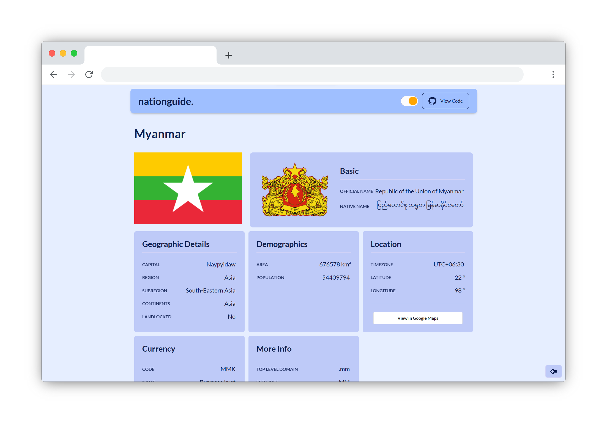

<a name="readme-top"></a>

<details> 
  <summary>Table of Contents</summary>

- [🌍 Nation Guide - Country Information Webapp](#-nation-guide---country-information-webapp)
  - [🚀 Visit Website](#-visit-website)
  - [🧰 Tech Stack](#-tech-stack)
  - [🔥 Features](#-features)
  - [⚙️ Development](#️-development)
  - [💻 Getting Started](#-getting-started)
    - [Prerequisites](#prerequisites)
    - [Setup](#setup)
    - [Install](#install)
    - [Usage](#usage)
    - [Run tests](#run-tests)
    - [Deployment](#deployment)
  - [📧 Contact](#-contact)
  - [🔭 Future Features](#-future-features)
  - [🤝 Contributing](#-contributing)
  - [💖 Show your support](#-show-your-support)
  - [💎 Useful Resources](#-useful-resources)
  - [📝 License](#-license)

</details>

# 🌍 Nation Guide - Country Information Webapp

[](https://github.com/indiecodermm/nation-guide)
[](https://github.com/indiecodermm/nation-guide/blob/main/LICENSE)
[](https://github.com/indiecodermm/nation-guide/commits)


**Nation Guide** is an dynamic web application designed to provide users with a comprehensive database of country details. This project aimed to provide an efficient and user-friendly tool for users to quickly access information about countries. The app is fully responsive for mobile devices and optimized for a smooth user experience. 

## 🚀 Visit Website

Experience the live website at [Nation Guide Webapp](https://nation-guide-icmm.onrender.com).





<p align="right">(<a href="#readme-top">back to top</a>)</p>


## 🧰 Tech Stack


## 🔥 Features

- **Explore Countries**: Browse through a list of countries worldwide.
- **Quick Search**: Find countries by their names in a flash.
- **Sort & Find**: Easily organize countries by area or name.
- **Detailed Information**: Get detailed information about each country.
- **Share Easily**: Share country facts with friends.
- **Day & Night Modes**: Switch between dark and light themes.
- **Mobile Friendly**: Enjoy a smooth experience on your phone.
- **Easy Navigation**: Navigate between pages with ease.
- **Real-time Updates**: Get the latest country data from REST Countries API.


<p align="right">(<a href="#readme-top">back to top</a>)</p>

## ⚙️ Development

This app was developed using the latest industry-standards and best practices. The codebase is highly modularized and organized for easy maintenance and scalability. 

<details>
  <summary>Project Structure</summary>
  <br>

With a focus on clean code and reusability, the project is structured as follows:

```
.
└── src/
    ├── assets
    ├── components/
    │   ├── styles
    │   ├── Navbar.jsx
    │   └── Footer.jsx
    ├── hooks
    ├── redux/
    │   ├── configureStore.js
    │   └── slice.js
    ├── lib/
    │   └── utils.js
    ├── pages/
    │   ├── Home/
    │   │   ├── index.jsx
    │   │   └── Countries.jsx
    │   ├── Detail
    │   └── NotFound.jsx
    ├── services
    ├── tests
    ├── App.jsx
    ├── index.jsx
    ├── index.css
    └── propTypes.js
```

</details>

## 💻 Getting Started

To get a local copy up and running, follow these steps.

### Prerequisites

In order to run this project you need [Node.js](https://nodejs.org/en/) installed on your machine.

### Setup

Clone this repository to your desired folder:

```sh
  cd my-project
  git clone git@github.com:IndieCoderMM/nation-guide.git .
```

### Install

Install the dependencies with:

```sh
  npm install
```

### Usage

To run the project, execute the following command:

```sh
  npm start
```

### Run tests

To run tests, run the following command:

```sh
  npm run test
```

### Deployment

You can deploy this project using:

```sh
  npm run build
```
This will create a production-ready build of your website in `build/` folder, which you can use to deploy on a static site hosting platform.

<p align="right">(<a href="#readme-top">back to top</a>)</p>


## 📧 Contact 

I am always looking for ways to improve my project. If you have any suggestions or ideas, I would love to hear from you.

[](https://github.com/IndieCoderMM)
[](https://linkedin.com/in/hthantoo)
[](mailto:hthant00chk@gmail.com)

<p align="right">(<a href="#readme-top">back to top</a>)</p>


## 🔭 Future Features

- [x] **Add desktop UI**
- [x] **Include link to map**
- [x] **Dark/Light mode**
- [ ] **User authentication**
- [ ] **Favorite countries**

<p align="right">(<a href="#readme-top">back to top</a>)</p>


## 🤝 Contributing 

I welcome any and all contributions to my website! If you have an idea for a new feature or have found a bug, please open an issue or submit a pull request.

Feel free to check the [issues page](../../issues/).

<p align="right">(<a href="#readme-top">back to top</a>)</p>


## 💖 Show your support 

If you like this project, please consider giving it a ⭐.

<p align="right">(<a href="#readme-top">back to top</a>)</p>


## 💎 Useful Resources

- [Design Insipration](https://www.frontendmentor.io/challenges/rest-countries-api-with-color-theme-switcher-5cacc469fec04111f7b848ca) - Frontend Mentor Challenge
- [Rest Countries API](https://restcountries.com/#api-endpoints-v3-all) - API to get information about all countries
- [Undraw Illustrations](https://undraw.co/) - Open-source illustrations

<p align="right">(<a href="#readme-top">back to top</a>)</p>


## 📝 License

This project is [MIT](./LICENSE) licensed.

<p align="right">(<a href="#readme-top">back to top</a>)</p>